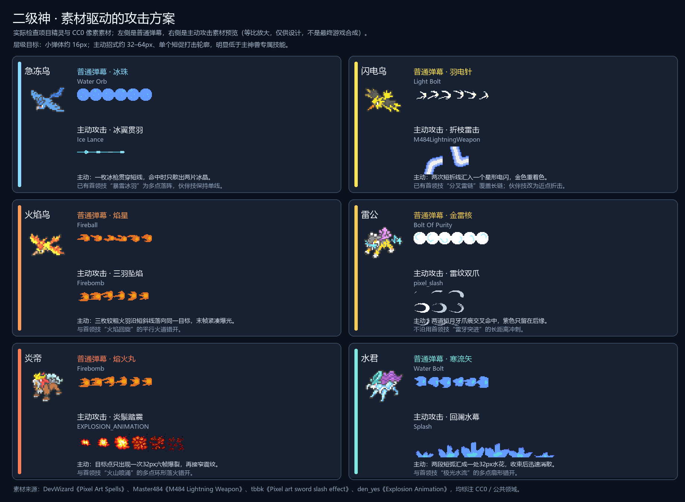
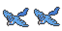
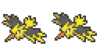
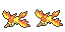
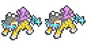
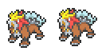
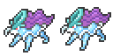

# 二级神入队攻击：素材核验与视觉方案

**当前阶段：** 已完成素材核验、六只攻击设计、运行时图集构建与入队攻击接入。本文保留素材对照板作为来源与造型依据。

对照板左侧是项目内神兽图标与普通弹幕素材，右侧是主动攻击素材。素材按最近邻放大以便看清像素；它是素材与构图方案，不是最终游戏内合成效果。

## 选中的素材

| 来源与许可 | 我实际检查到的内容 | 适用方向 |
|---|---|---|
| [Pixel Art Spells — DevWizard（CC0）](https://opengameart.org/content/pixel-art-spells) | 水球、水矢、冰枪、细光弹、火球、火焰炸弹均为横向逐帧图；普通弹素材是 16×16 单帧格，所选条带为 4 或 6 帧；Splash 是 6 帧、每帧 32×32。像素边缘干净，蓝、白、橙色素材和项目图标的清晰色块比较协调。 | 六只的基础弹幕、急冻鸟冰枪、火焰鸟火炸弹、水君水花。作者表示欢迎署名 DevWizard，CC0 不强制署名。 |
| [M484 Lightning Weapon — Master484（CC0 / 公共领域）](https://opengameart.org/content/m484-lightning-weapon) | 实图包含 30×30 的直线、90°转折、分叉/交汇和星点部件；页面说明 40 种部件各有两种状态。素材是可拼装的闪电段，不是现成的屏幕级雷暴。 | 闪电鸟主动技只取两段短折线和一个末端闪点，按项目角色配色染成金黄。 |
| [Pixel art sword slash effect — tbbk（CC0）](https://opengameart.org/content/pixel-art-sword-slash-effect) | 192×141 的透明图，排成 3×3；每格约 64×47，能看到不同长度与弧度的浅色月牙斩痕。它是造型变体图，不假称为逐帧动画。 | 雷公主动技挑两道弧形爪痕交叉，调成金色主痕、紫色后缘。 |
| [Explosion Animation — den_yes（CC0）](https://opengameart.org/content/explosion-animation-1) | 透明 PNG 为 192×32 的 6 帧横条，每格 32×32；实际预览从亮核扩张为橙红像素爆裂，再快速衰减。 | 炎帝主动技的单点踏击爆裂，配合一圈细短震纹。 |

我也检查了 [StarsteelGaming 的法术序列（CC0）](https://opengameart.org/content/spell-effects-by-starsteelgaming)：火球、冰枪和雷球帧数齐全，但边缘有更柔的泛光，和项目里 64×64 的硬边像素神兽并排时不够统一，因此没有导入。

## 六只的攻击区分

项目图标每只为 128×64，内含两个 64×64 帧。现有野外首领技能在 `src/legendary-attacks.js`，伙伴招式刻意避开首领的大范围几何：

| 神兽原图与已有首领技 | 普通弹幕 | 主动专属技 | 主动技的素材轮廓与差异 |
|---|---|---|---|
|  **急冻鸟** · 暴雪冰羽 | **霜珠**：小型浅蓝圆珠，连续轻点射。 | **冰翼贯羽**：短暂瞄准后，一枚细冰枪贯穿窄直线；命中散出两片冰晶。 | 普通为圆、主动为针状贯线；不会重复首领的多点冰羽落阵。主动用 Ice Lance 条带，碎晶沿用项目现有 shard glyph。 |
|  **闪电鸟** · 分叉雷链 | **羽电针**：白芯细黄电针，单发快速飞出。 | **折枝雷击**：目标附近亮起短提示，两段 30px 雷线折转后汇成一个星闪。 | 普通为一枚直线弹、主动为短促折线组件；不拉长成首领的多分支雷链。雷段按角色黄羽重着色，闪点取 M484 组件。 |
|  **火焰鸟** · 火焰回旋 | **焰星**：16px 小火球，拖一截短焰尾。 | **三羽坠焰**：三枚较粗火羽沿短斜线落向同一目标点，合点只留一次小爆光。 | 普通为单颗快弹、主动为三段坠击；不复制首领的平行火道。分别用 Fireball 与 Firebomb 帧条。 |
|  **雷公** · 雷牙突进 | **金雷核**：圆形白芯雷珠，染成金紫色。 | **雷纹双爪**：两道短月牙爪痕先后交叉，尾缘带一闪紫色余痕。 | 普通为圆核、主动为交叉斩痕；不沿用首领的长距离直线冲刺。使用 slash 形状变体，而非加粗普通弹。 |
|  **炎帝** · 火山喷涌 | **熔火丸**：缩小的重火弹，尾焰更短，飞行节奏比火焰鸟沉。 | **炎鬃踏震**：命中点出现一次 32px 六帧爆裂，再接一圈低矮细震纹。 | 普通是沉重单弹、主动是单点踏击；不铺开成首领的多点火山阵。主爆裂使用 Explosion Animation。 |
|  **水君** · 极光水流 | **寒流矢**：细小蓝青水矢，直线轻射。 | **回澜水幕**：两段短弧从目标两侧汇合，出现一朵 32px 水花后收束。 | 普通是直线小弹、主动是弧线汇流；不重复首领的五点扇形水流。水矢和 Splash 是两种不同图形素材。 |

## 表现层级

普通弹幕保持单体、小尺寸、快速重复，主要负责持续攻击反馈。主动技则要有自己的准备提示、命中形状和收尾节奏；不把普通弹幕简单放大，也不共用同一张弹体图。主动特效以 32–64px 的主体、一个明确打击轮廓和少量碎光为上限，范围和亮度控制在主神兽专属技能的约一半；不加全屏泛光或大幅震屏。

这份设计解决了“普通弹幕和主动技能看起来一样”的问题：每只神兽的普通弹幕与主动技选用不同的素材轮廓，并且主动技的运动轨迹也不同。普通射击已注册为六只伙伴的日常攻击；主动技有独立短预警、命中几何与收尾动画。主动技以 32–64px 的主体、一个明确打击轮廓和少量碎光为上限，范围和亮度控制在主神兽专属技能的约一半；不加全屏泛光或大幅震屏。

## 接入与验证

- CC0 原始包与来源 PNG 保存在 `assets/vfx/sublegendary/source/`；运行 `python tools/build-sublegendary-vfx-atlas.py` 可重建 512×512、59 帧的透明最近邻运行时图集。
- 普通弹体各用 16×16 源图动画帧；主动技分别使用冰枪、M484 闪电拼片、火焰炸弹、月牙斩痕、32×32 爆炸和 32×32 水花。缺少图集时主动技仍保留程序化小型回退轮廓。
- 图鉴训练场的“播放神兽招式”现在也覆盖六只二级神；命中震屏、冲击波、命中点粒子和预警线宽低于一级神兽。
- 验证：`node sim-test.mjs 0.1` 全套模拟通过，包含普通射击、六种主动技预警与命中、独立材质和绘制预算；图集脚本可成功从原始素材重建。
